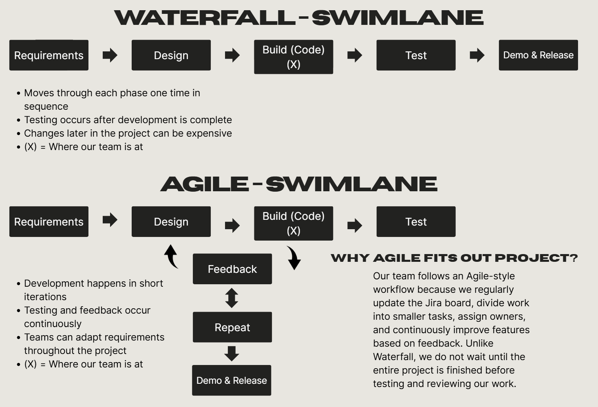

|EXPLANATION|
|-----|
|This diagram illustrates the Software Development Life Cycle (SDLC) using both Waterfall and Agile approaches. In the Waterfall model, each phase is completed once in a sequential order, while Agile uses short, repeating cycles that incorporate testing and feedback throughout development.|

## Swimlane Roles/ Responsibilities
| Phase | Project Manager | Business Analyst | Data Analyst | Quality Analyst
|----|----|----|----|----|
| Requirements | Responsible for deadlines, budget, and deliverables. | Think about the marketability of a product. ensures that the product makes sense from a financial standpoint.Sees to it that the overhead cost of developing and running the product is not too high. Thinks about possible future contracts in order to find clients for the product. | Find/collect, review, and clean data: trends, predictions, and final analytics. | Do market research to see what similar products are already out there and what they do and how they do it. Start brainstorming what the product should do and how it can do it best. |
| Design | Filter information in Jira, Planner, or other PM tools. | Maps out the overhead of producing the product, dictates which resources the company can pay for while the product isn’t in the market yet. Does market research to see who specifically the product appeals to and how that demographic would like the product to be like. | Design rough draft diagrams that convey data in a way that is easy to understand to clients or coworkers. | Ensure that the wireframes look aesthetic and the idea is concise. Make sure that all requirements are planned to be met. |
| Build | Connect departments and leaders to collaborate on projects. | Ensures that the cost of building the product is something that the company can pay for. Continues market research whilst advising their team how the predicted client base would like the product to look or feel like. | Create and implement diagrams and predictions for data. | Ensure that every part of the product being built works properly as soon as they’re built. Ensures that all requirements for each element are being met. |
| Test | Check for deadlines and see how far the team is to budget and deadline date | Starts setting focus groups to see how they feel about specific product features. Gives production team feedback on what the focus group thought and thinks about how the product can be marketed. | Review with team to ensure that the information is easily readable and understandable, start building frontend diagrams. | Make sure to annotate every bug found. Try to innovate on any features before the Demo phase.Uses focus group feedback to make adjustments to the product. |
| Demo & Release | Compare how far the project ended off budget and timeline (if any) and share opportunities. | Starts marketing the product based on data gathered from Focus Groups. Starts finding and connecting with clients in order to set up contracts. Present the product to different buyers and explains how the product was made with them in mind. | Upload data analysis, predictions, and diagrams to the app/webpage. | Uses feedback from Stakeholders or clients to make a better product. Starts thinking about how better versions could be improved later on. |